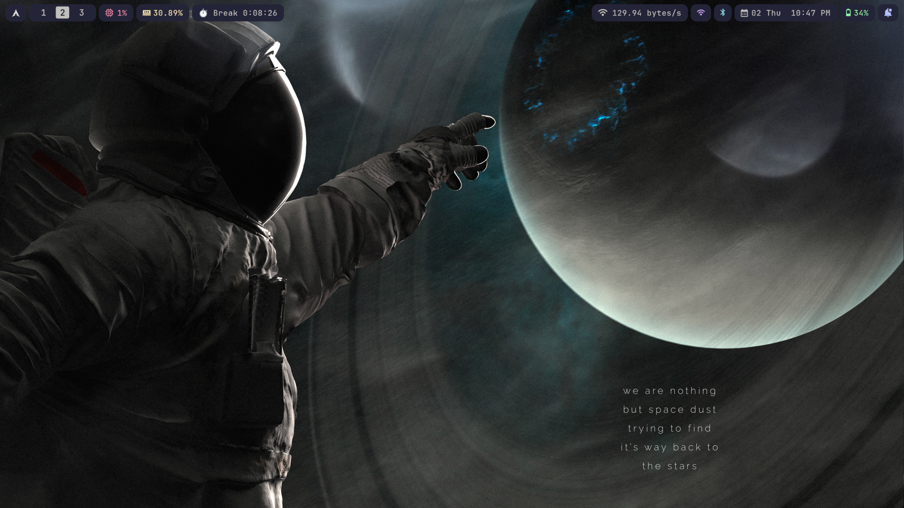
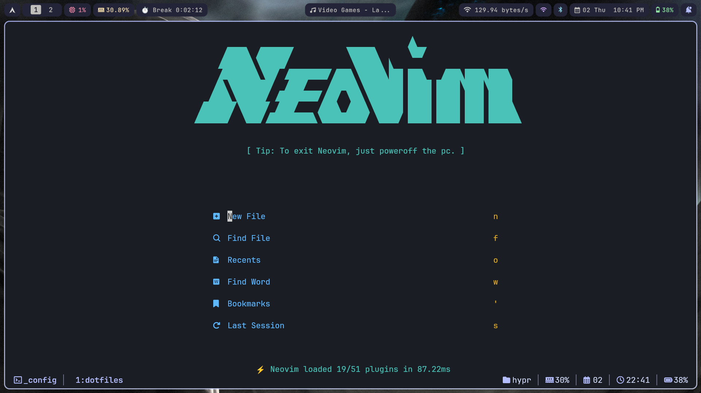
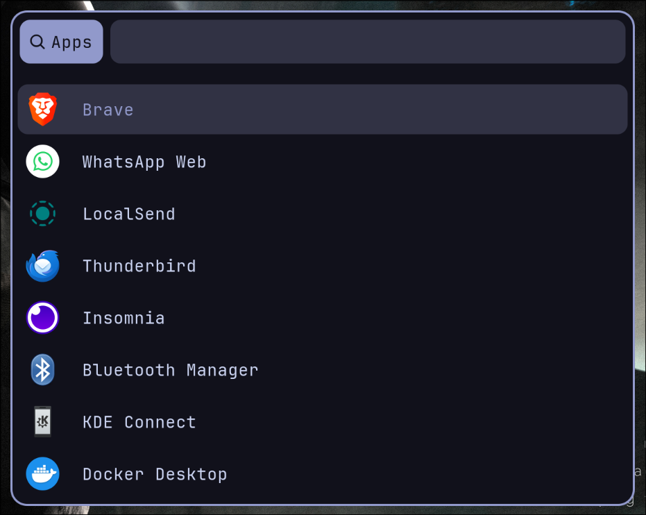

## 🚀 My Dotfiles

<div align="center">

[](https://opensource.org/licenses/MIT)
[](https://github.com/binoymanoj/dotfiles/stargazers)
[](https://github.com/binoymanoj/dotfiles/issues)

*A carefully crafted collection of configuration files for a modern Linux desktop environment*

[**📸 Screenshots**](#-screenshots) • [**⚡ Quick Start**](#-quick-start) • [**🔧 Components**](#-components) • [**📦 Setup**](#-setup)

</div>

---

## 🎨 Preview

<div align="center">

<p><em>Complete desktop setup with Archlinux + Hyprland + Hyprpanel</em></p>
</div>

<details>
<summary>🖼️ More Screenshots</summary>

### 🖥️ Terminal


### 📝 Text Editing


### 🧑‍💻 Tmux (Terminal multiplexer)


> Tmux Status Line


### 🖥️ Hyprpanel 


### 🖼️ Rofi 


</details>

## ✨ Features

- 🎯 **Minimalist Design** - Clean, distraction-free interface
- ⚡ **High Performance** - Optimized for speed and efficiency  
- 🎨 **Consistent Theming** - Unified color scheme across all applications
- ⌨️ **Keyboard-Driven** - Extensive keybindings and shortcuts
- 🔧 **Highly Customizable** - Easy to modify and extend
- 📱 **Modern Wayland** - Built for the future of Linux desktop

## 🔧 Components

#### Note: I have configuration for many packages in this dotfiles, but I'm not using all of them. For example I have a good config for waybar, but currently I'm using hyprpanel. Go through the configs and use which one you like the most (for some packages I have config for 2 or more)

### 🖥️ Window Manager & Desktop
| Component | Description | Config |
|-----------|-------------|--------|
| **[Hyprland](https://github.com/hyprwm/Hyprland)** | Dynamic tiling Wayland compositor | [`hypr/`](./hypr) |
| **[HyprPanel](https://github.com/Jas-SinghFSU/HyprPanel)** | Customizable panel for Hyprland | [`hyprpanel/`](./hyprpanel) |
| **[Waybar](https://github.com/Alexays/Waybar)** | Highly customizable Wayland bar | [`waybar/`](./waybar) |
| **[Rofi](https://github.com/davatorium/rofi)** | Application launcher and dmenu replacement | [`rofi/`](./rofi) |
| **[Dunst](https://github.com/dunst-project/dunst)** | Lightweight notification daemon | [`dunst/`](./dunst) |

### 📝 Editors & Terminal
| Component | Description | Config |
|-----------|-------------|--------|
| **[Neovim](https://github.com/neovim/neovim)** | Hyperextensible Vim-based text editor | [`nvim/`](./nvim) |
| **[AstroNvim](https://github.com/AstroNvim/AstroNvim)** | My Personal Favorite Distro for Neovim | [`nvim/`](./nvim) |
| **[Kitty](https://github.com/kovidgoyal/kitty)** | Fast, feature-rich GPU-based terminal | [`kitty/`](./kitty) |
| **[Ghostty](https://github.com/mitchellh/ghostty)** | Fast, native, feature-rich terminal emulator | [`ghostty/`](./ghostty) |
| **[Tmux](https://github.com/tmux/tmux)** | Terminal multiplexer | [`tmux/`](./tmux) |

### 🌐 Applications
| Component | Description | Config |
|-----------|-------------|--------|
| **[Qutebrowser](https://github.com/qutebrowser/qutebrowser)** | Keyboard-focused browser | [`qutebrowser/`](./qutebrowser) |
| **[Yazi](https://github.com/sxyazi/yazi)** | Blazing fast terminal file manager | [`yazi/`](./yazi) |
| **[MPV](https://github.com/mpv-player/mpv)** | Command line video player | [`mpv/`](./mpv) |
| **[Zathura](https://github.com/pwmt/zathura)** | Document viewer | [`zathura/`](./zathura) |

### ⚙️ System Tools
| Component | Description | Config |
|-----------|-------------|--------|
| **[Kanata](https://github.com/jtroo/kanata)** | Cross-platform software keyboard remapper | [`kanata/`](./kanata) |
| **[Waypaper](https://github.com/anufrievroman/waypaper)** | Wallpaper manager for Wayland | [`waypaper/`](./waypaper) |
| **[Fastfetch](https://github.com/fastfetch-cli/fastfetch)** | System information tool | [`fastfetch/`](./fastfetch) |

## 📦 Setup

### 🚀 Quick Start

```bash
# Clone the repository
git clone https://github.com/username/dotfiles.git ~/.dotfiles
cd ~/.dotfiles

cp * ~/.config -r
```

### 🎯 Manual Setup (recommended)

```bash
cp -r dotfiles/hypr ~/.config/hypr
cp -r dotfiles/nvim ~/.config/nvim
cp -r dotfiles/kitty ~/.config/kitty
# ... repeat for other configs
```

### 📋 Dependencies

<details>
<summary>Click to expand dependency list</summary>

#### Core Dependencies
```bash
# Arch Linux
sudo pacman -S hyprland waybar rofi dunst kitty neovim tmux git

# Ubuntu/Debian
sudo apt install sway waybar rofi dunst kitty-terminal neovim tmux git
```

#### Other Dependencies
```bash
# Additional tools
sudo pacman -S mpv zathura qutebrowser yazi fastfetch playerctl
```

</details>

## ⌨️ Key Bindings

| Shortcut | Action |
|----------|--------|
| `Super + Enter` | Open terminal |
| `Alt + Space` | Application launcher |
| `Super + C` | Close window |
| `Super + [1-9]` | Switch workspace |
| `Super + Shift + [1-9]` | Move to workspace |
| `Super + F` | Toggle fullscreen |

### This is only covering very few keybinds. I'll add all the keybinds in a separate file (you can check all the keybinds in the ~/hypr/hyprland.conf file)

<details>
<summary>View all keybindings</summary>

[Full keybinding documentation](./docs/keybindings.md)

</details>

## 🎨 Customization

<!-- ### 🌈 Color Scheme -->
<!-- The dotfiles use a consistent color palette across all applications: -->
<!---->
<!-- ```css -->
<!-- /* Main Colors */ -->
<!-- --primary: -->
<!-- --secondary: -->
<!-- --accent: -->
<!-- --background: -->
<!-- --foreground: -->
<!-- ``` -->

### ✏️ Modifying Configs
1. Edit the configuration files in their respective directories
2. Most changes take effect immediately or after reloading the application
3. For Hyprland changes: `Super + Shift + R` to reload

## 🐛 Troubleshooting

<details>
<summary>Common Issues</summary>

### Application not running
- Make sure that all the packages and it's dependencies are installed for the application
- Double check the config
- Restart the application

### Hyprland not starting
- Check if your GPU supports Wayland
- Verify all dependencies are installed
- Check logs: `journalctl -u hyprland`

### Fonts not rendering correctly  
- Install required fonts: `JetBrains Mono Nerd Font`
- Clear font cache: `fc-cache -fv`

</details>

## 🤝 Contributing

Contributions are welcome! Please feel free to:

1. 🍴 Fork the repository
2. 🌟 Create a feature branch
3. 💡 Make your improvements
4. 📝 Submit a pull request

## 📄 License

This project is licensed under the MIT License - see the [LICENSE](LICENSE) file for details.

## 💝 Acknowledgments

- Thanks to all the amazing open-source projects that make this setup possible
- Special thanks to the Archlinux, Hyprland, Neovim and Tmux communities

---

<div align="center">

**⭐ If you found this helpful, please consider giving it a star! ⭐**

*Made with ❤️ and lots of ☕*

</div>
